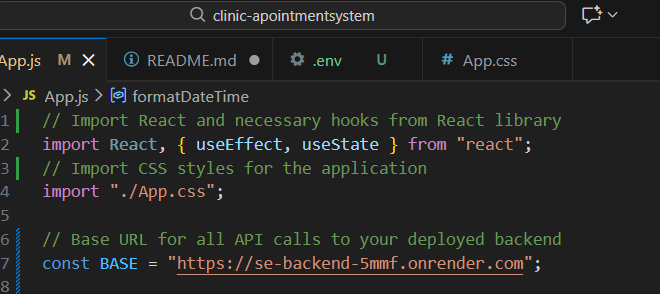

# Clinic Appointment System - Full Stack CRUD Application

## Live Links
- **Frontend:** :https://se-frontend-gray.vercel.app/
- **Backend API:** https://se-backend-5mmf.onrender.com

## Features
Complete CRUD operations (Create, Read, Update, Delete)  
 Three main entities: Patients, Doctors, Appointments  
 Form validation for all inputs  
 Responsive UI with navigation  
 Deployed full-stack application  

## Technology Stack
- **Frontend:** React.js, CSS
- **Backend:** Node.js, Express.js, MongoDB
- **Deployment:** Vercel (frontend), Render (backend)
- **Database:** MongoDB Atlas

## API Endpoints

### Patients
- `GET /patients` - Retrieve all patients
- `POST /patients` - Create new patient
- `PUT /patients/:id` - Update patient
- `DELETE /patients/:id` - Delete patient

### Doctors
- `GET /doctors` - Retrieve all doctors
- `POST /doctors` - Create new doctor  
- `PUT /doctors/:id` - Update doctor
- `DELETE /doctors/:id` - Delete doctor

### Appointments
- `GET /appointments` - Retrieve all appointments
- `POST /appointments` - Create new appointment
- `PUT /appointments/:id` - Update appointment
- `DELETE /appointments/:id` - Delete appointment

## Setup Instructions

### Backend
1. Clone repository
2. `npm install`
3. Create `.env` file with MongoDB URI
4. `npm start`

### Frontend  
1. Clone repository
2. `npm install`
3. `npm start`

## Screenshots

